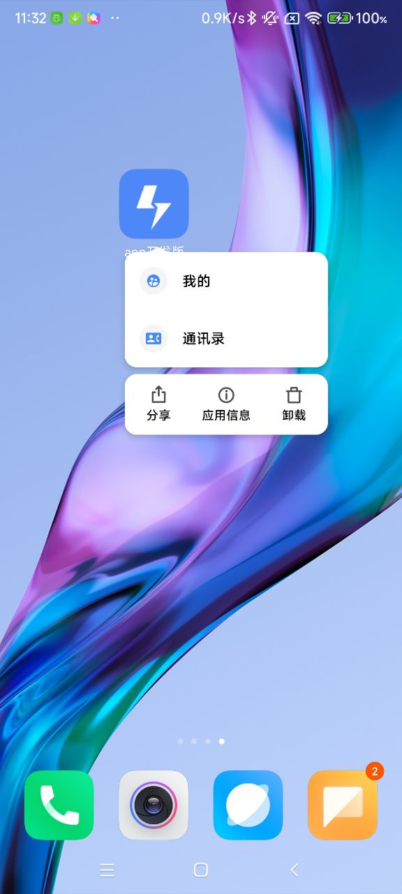
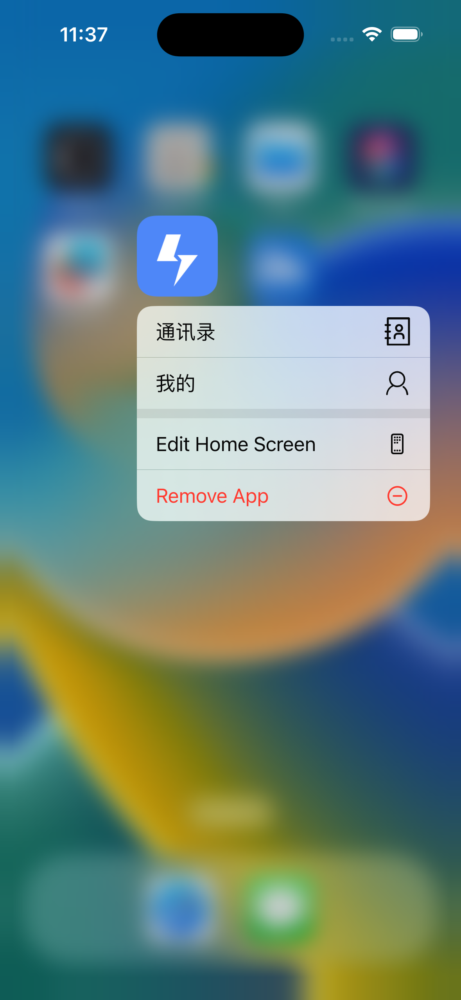

## 如何替换启动页

```code
yarn add react-native-bootsplash

yarn react-native generate-bootsplash path-to-logo-image
```

可选参数：

- --background-color=[color] 启动页背景色。hex 格式

- --logo-width=[width] 1 倍图 logo 大小（正方形）。默认为 100

- --assets-path=[path] logo 存放在项目目录下的位置

- --flavor=[flavor] 安卓下有效。表示不是`main`目录的安卓资源文件夹

生成文件示例：

```code
android/app/src/main/res/drawable/bootsplash.xml
android/app/src/main/res/values/colors.xml (creation and edition)
android/app/src/main/res/mipmap-hdpi/bootsplash_logo.png
android/app/src/main/res/mipmap-mdpi/bootsplash_logo.png
android/app/src/main/res/mipmap-xhdpi/bootsplash_logo.png
android/app/src/main/res/mipmap-xxhdpi/bootsplash_logo.png
android/app/src/main/res/mipmap-xxxhdpi/bootsplash_logo.png

ios/YourProjectName/BootSplash.storyboard
ios/YourProjectName/Images.xcassets/BootSplashLogo.imageset/bootsplash_logo.png
ios/YourProjectName/Images.xcassets/BootSplashLogo.imageset/bootsplash_logo@2x.png
ios/YourProjectName/Images.xcassets/BootSplashLogo.imageset/bootsplash_logo@3x.png

# Only if --assets-path was specified
assets/bootsplash_logo.png
assets/bootsplash_logo@1,5x.png
assets/bootsplash_logo@2x.png
assets/bootsplash_logo@3x.png
assets/bootsplash_logo@4x.png
```

## 如何替换应用图标

本模板内置了`@bam.tech/react-native-make`作为替换应用图标的解决方案，你只需要执行下面的代码就可以很方便地替换应用图标：

```code
npx react-native set-icon --path path-to-image
```

要求：

- `path-to-image` 指向图片的路径必填
- 图片必须是正方形的
- 图片不能有透明图层，两个平台都不支持
- 图片最大尺寸是 1024 \* 1024
- 支持安卓自适应图标
- 图片格式支持.png 和 .jpeg
- 安卓平台下，上面的命令会在 android/app/src/main/res 目录下生成一堆图标文件

## 如何生成 svg 图标

- 把图表对应的 svg 文件放在根目录下的 icon-svg 文件夹下
- 执行命令 `npx svgicon-init` 生成配置文件：

```json
{
  "save_dir": "", // 生成图标文件的保存位置，推荐 ./src/components/Icon
  "trim_icon_prefix": "icon", // 图标文件的统一前缀
  "default_icon_size": 20, // 图标文件的默认大小
  "icon_svg": "./icon-svg", // 图标文件的存放位置
  "for_library": false // 是否为组件库生成图标，默认是false，表示是为项目生成图标
}
```

- 执行命令 `npx svgicon-create` 在对应的 `save_dir` 下生成图标组件

## 如何应用字体文件

本模板内置了`PingFang FC` 和 `Roboto` 两种字体文件，你可以不做任何修改直接使用，但是如果你不喜欢这两种字体，想要换成其他的字体文件，你可以这样做：

- 在`assets/fonts/`目录下，将你想要实用的字体文件复制进来
- 执行`npx react-native-asset`命令，会自动将字体文件映射到 Android 和 IOS 原生配置中
- 删除`android/app/src/main/assets/fonts`目录下原先的字体文件
- 删除`ios/rnTemplate/Info.plist`文件里原先的字体文件
- 修改`theme.ts`文件里的`textVariants`配置项，组件库默认的配置里是没有字体的，所以你需要把你想要使用的字体配置进去，例如本模板中内置的改动：

```js
import { helpers, theme } from '@td-design/react-native';

const { px } = helpers;
/** 覆盖默认的variants */
const extraVariants = {
  h0: {
    fontWeight: 'bold',
    fontSize: px(28),
    lineHeight: px(40),
    fontFamily: 'PingFang SC',
  },
  h1: {
    fontWeight: 'bold',
    fontSize: px(18),
    lineHeight: px(26),
    fontFamily: 'PingFang SC',
  },
  h2: {
    fontWeight: 'bold',
    fontSize: px(16),
    lineHeight: px(22),
    fontFamily: 'PingFang SC',
  },
  h3: {
    fontWeight: 'bold',
    fontSize: px(14),
    lineHeight: px(20),
    fontFamily: 'PingFang SC',
  },
  p0: {
    fontSize: px(16),
    lineHeight: px(22),
    fontFamily: 'PingFang SC',
    fontWeight: 'normal',
  },
  p1: {
    fontSize: px(14),
    lineHeight: px(20),
    fontFamily: 'PingFang SC',
    fontWeight: 'normal',
  },
  p2: {
    fontSize: px(12),
    lineHeight: px(16),
    fontFamily: 'PingFang SC',
    fontWeight: 'normal',
  },
  p3: {
    fontSize: px(10),
    lineHeight: px(14),
    fontFamily: 'PingFang SC',
    fontWeight: 'normal',
  },
  d0: {
    fontSize: px(24),
    lineHeight: px(32),
    fontFamily: 'Roboto',
    fontWeight: '700',
  },
  d1: {
    fontSize: px(18),
    lineHeight: px(26),
    fontFamily: 'Roboto',
    fontWeight: 'bold',
  },
  d2: {
    fontSize: px(12),
    lineHeight: px(20),
    fontFamily: 'Roboto',
    fontWeight: 'bold',
  },
};

export const lightTheme = {
  ...theme.lightTheme,
  colors: {
    ...theme.lightTheme.colors,
    iconBg: 'rgba(255,255,255,0.3)',
    tabActive: '#C6E1FD',
  },
  textVariants: {
    ...theme.lightTheme.textVariants,
    ...extraVariants,
  },
};

export type AppTheme = typeof lightTheme;

export const darkTheme: AppTheme = {
  ...theme.darkTheme,
  colors: {
    ...theme.darkTheme.colors,
    iconBg: 'rgba(255,255,255,0.3)',
    tabActive: '#C6E1FD',
  },
  textVariants: {
    ...theme.darkTheme.textVariants,
    ...extraVariants,
  },
};
```

需要注意的是，由于组件库中很多组件使用的是 theme 里面预置的一些 variants（h0 ~ h3、 p0 ~ p3、 d0 ~ d2），所以建议你不要去改动这些预置 variants 的配置，仅仅是给它们加上`fontFamily`就好，如果项目中这些不够你使用，我们还扩展了从 h4 ~ h9、 p4 ~ p9、 d3 ~ d9 来方便你补充自己想要的样式。

## 创建 keystore

### 创建开发环境 keystore

```code
$ keytool -genkey -v -keystore ./android/app/debug.keystore -storepass android -alias androiddebugkey -keypass android -keyalg RSA -keysize 2048 -validity 10000
```

### 创建生产环境 keystore

```code
$ keytool -genkeypair -v -storetype PKCS12 -keystore ./android/app/my-release-key.keystore -alias my-key-alias -keyalg RSA -keysize 2048 -validity 10000
```

## 配置外链打开 app 内指定页面以及传参

本模板已经内置了通过外链唤起 app 的功能，主要是通过配置`URL Scheme` 以及`Deeplinking` 来实现从外部打开 app 内指定页面的功能。 如果你想要把`URL Scheme`改成你自己的：

1. 在`android/app/src/main/AndroidManifest.xml`文件里修改`android:scheme`的值
2. 在`ios/rnTemplate/Info.plist`文件里修改`URL types`的`URL Schemes`的值
3. 在`src/linking.ts`文件里同步修改`prefixes`配置项

下面主要介绍一下`Deeplinking`的配置，`Deeplinking`的配置在`src/linking.ts`文件里，配置项如下：

```ts
export const linking: LinkingOptions<AppParamList> = {
  enabled: true,
  prefixes: ['rntemplate://'],
  config: {
    // 必须要配置一个initialRoute，否则从外部打开APP内某个页面之后，没有返回按钮
    // 另外，initialRoute必须要是无参的！
    initialRouteName: 'Tab',
    screens: {
      // 任何没有匹配成功的都会跳转到这个界面
      NotFound: '*',
      // Tab嵌套的页面配置需要这么写
      Tab: {
        screens: {
          Homepage: 'homepage',
          Mine: 'mine',
        },
      },
      // 无传参的页面的URL写法是: rntemplate://charts
      EchartsDemo: 'charts',
      // RESTFUL风格的URL传参写法是: rntemplate://detail/1
      DetailDemo: 'detail/:id',
      // 有传参的页面的URL写法是: rntemplate://form?username=test&password=test
      LinkingFormDemo: 'form',
    },
  },
};
```

传参接收参数的方式可以查看`DetailDemo`和`LinkingFormDemo`这两个例子。更多关于`Deeplinking`的配置可以参考[官方文档](https://reactnavigation.org/docs/configuring-links)。

## IOS Universal Links / Android App Links

可以直接参考以下几个链接进行配置：

- [【iOS】Universal Link 实施步骤](https://juejin.cn/post/7120948425863987237)
- [短信链接唤起 App](https://juejin.cn/post/7107451944846753806)
- [iOS Universal Link](https://www.jianshu.com/p/ef0cd17a35d6)

## 编译问题

### MMKV 编译报错

如果遇到一下报错：

```txt
FAILURE: Build failed with an exception.

* What went wrong:
Execution failed for task ':react-native-mmkv:generateJsonModelRelease'.
> /Users/runner/work/1/s/node_modules/react-native-mmkv/android/CMakeLists.txt : C/C++ release|armeabi-v7a : CMake Error: The following variables are used in this project, but they are set to NOTFOUND.
  Please set them or make sure they are set and tested correctly in the CMake files:
  JSI_LIB
      linked by target "reactnativemmkv" in directory /Users/runner/work/1/s/node_modules/react-native-mmkv/android
  REACT_NATIVE_JNI_LIB
      linked by target "reactnativemmkv" in directory /Users/runner/work/1/s/node_modules/react-native-mmkv/android

```

请执行以下命令：

```code
cd android && ./gradlew clean
```

然后再重新 build 即可。

### hermes-engine 下载失败

默认下载地址：

```code
https://repo1.maven.org/maven2/com/facebook/react/react-native-artifacts/#{version}/react-native-artifacts-#{version}-hermes-ios-#{build_type.to_s}.tar.gz
```

首先通过链接: [hermes-engine 压缩包](https://pan.baidu.com/s/1GxiMght61h9o8dzEUHUy8g?pwd=c1ag) 下载压缩包， 然后把安装包放在`ios/fastlane`目录下，然后执行以下命令:

```code
yarn pod
```

即可安装成功。具体可以参考：[https://github.com/facebook/react-native/issues/31505#issuecomment-1245424395](https://github.com/facebook/react-native/issues/31505#issuecomment-1245424395)

### 9. 修改 cocopods 源：

```code
cd ~/.cocoapods/repos
pod repo remove master
git clone https://mirrors.tuna.tsinghua.edu.cn/git/CocoaPods/Specs.git master
```

## 集成 fastlane

本模板已经集成了 fastlane，如果你想要使用，需要先安装 ruby，然后安装 fastlane，具体可以参考[fastlane 官网](https://docs.fastlane.tools)。同时我们内置了[fir.im](https://www.betaqr.com/)作为 APP 的分法平台。建议你修改`fastlane/Fastfile`文件里的`fir_cli/api_token`为你自己的 token，这样就可以在打包的时候自动上传到`fir.im`了。

## 集成 code-push 并配置私有化服务器

- 按照[code-push-server](https://github.com/shm-open/code-push-server/blob/master/docs/install-server-by-docker.cn.md) 这篇文章的介绍安装好私有化服务器

- 安装 code-push-cli

```code
npm install -g @shm-open/code-push-cli
```

- 登录私有化服务器

```code
code-push login [your server url]
```

默认用户名和密码是：admin/123456

- [react-native-code-push](https://github.com/crazycodeboy/RNStudyNotes/tree/master/React%20Native%E5%BA%94%E7%94%A8%E9%83%A8%E7%BD%B2%E3%80%81%E7%83%AD%E6%9B%B4%E6%96%B0-CodePush%E6%9C%80%E6%96%B0%E9%9B%86%E6%88%90%E6%80%BB%E7%BB%93)列举了很多的 API，你可以根据自己的需求来使用。

- 发布更新本模板内置了一个发布脚本，你可以直接执行以下命令即可：

```code
yarn codepush
```

## 支持 Shortcut(Android) / QuickAction(IOS)功能

### 1. 什么是 Shortcut / QuickAction

Android Shortcut 和 Apple Quick Action 都是针对移动设备操作系统的快捷方式功能。

- Android Shortcut 是 Android 操作系统提供的一种快捷方式功能，它可以让用户通过在主屏幕上长按应用图标来打开特定的应用程序功能或操作，例如直接进入应用程序中的某个部分或执行某个操作。Android Shortcut 可以自定义，开发者可以为自己的应用程序添加自定义的快捷方式。

- Apple Quick Action 则是 iOS 操作系统提供的快捷方式功能，它可以让用户通过在主屏幕上按住应用图标，快速地访问应用程序中的常用功能或操作。例如，你可以在主屏幕上直接查看最近的通知或发送一条新的消息。与 Android Shortcut 不同的是，Apple Quick Action 的功能是由操作系统自动为应用程序生成的，开发者无法自定义。

### 2. 如何使用

#### 2.1 Android

在`app/src/main/res`目录下，新建`drawable`目录， 然后把图片放到这个目录下。图片的名字可以自己定义，但是要和`useShortcut.ts`里的`icon`对应上。

你可以借助[icons-app-shortcut](https://romannurik.github.io/AndroidAssetStudio/icons-app-shortcut.html)这个工具来生成不同分辨率的图片。

#### 2.2 IOS

在`ios/rnTemplate/Images.xcassets`目录下新建 icon 名称对应的`.imageset`目录，然后把图片放到这个目录下(具体可以查看代码里的例子)。图片的尺寸要求一倍图是`35*35`，二倍图是`70*70`，三倍图是`105*105`。图片的名字可以自己定义，但是要和`useShortcut.ts`里的`icon`对应上。

#### 2.3 JS

在`useShortcut.ts`文件里有`shortcuts`的定义，实际使用时可以替换成自己的。

```ts
// 定义shortcuts，你可以替换成你自己的
const shortcuts = [
  { type: 'contact', title: '通讯录', icon: 'shortcut_contact' },
  { type: 'mine', title: '我的', icon: 'shortcut_mine' },
];
```

这里的`icon`对应的是上面 Android 和 IOS 里存放的图片的名字。

### 3. 实际效果

#### 3.1 Android



#### 3.2 IOS


